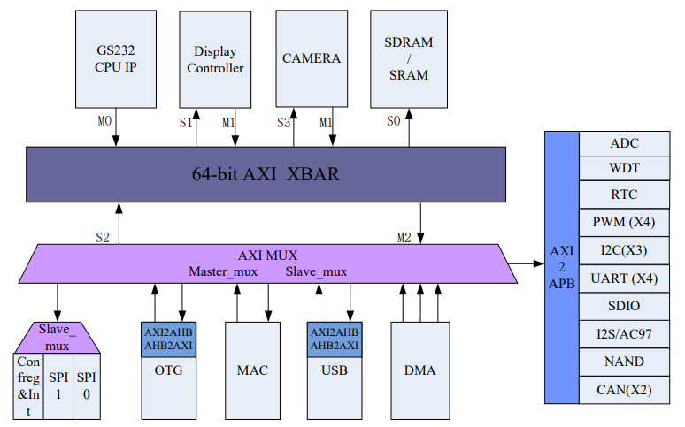

# [1C300B](https://doc.soc.xin/1C300B)

* [loongson](https://www.loongson.cn/): [LoongArch](https://github.com/SoCXin/LoongArch)
* [L4R4](https://github.com/SoCXin/Level): 240 GHz 

## [简介](https://github.com/SoCXin/1C300B)

[1C300B](https://www.loongson.cn/product/show?id=6) 采用 0.13um CMOS 工艺，是基于 GS232 处理器核的高性价比单芯片系统，可应用于指纹生物识别、物联传感等领域。

### 关键参数

* 240MHz  GS232 单核心（兼容MIPS32）
* 16KB 数据 cache 和 16KB 指令 cache
* SDRAM 接口，工作频率 33~133MHz

### [资源收录](https://github.com/SoCXin)

* [参考资源](src/)
* [参考文档](docs/)
* [参考工程](project/)

### [选型建议](https://github.com/SoCXin/1C300B)

[1C300B](https://github.com/SoCXin/1C300B)

### [www.SoC.xin](http://www.SoC.Xin)
